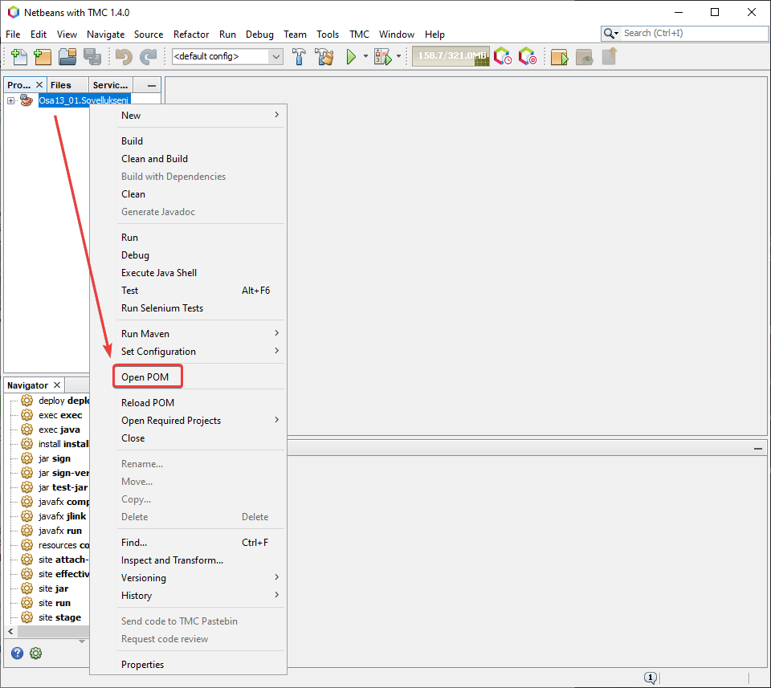
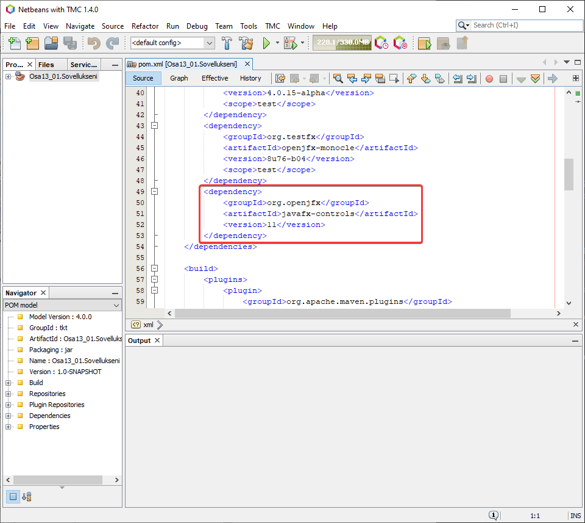
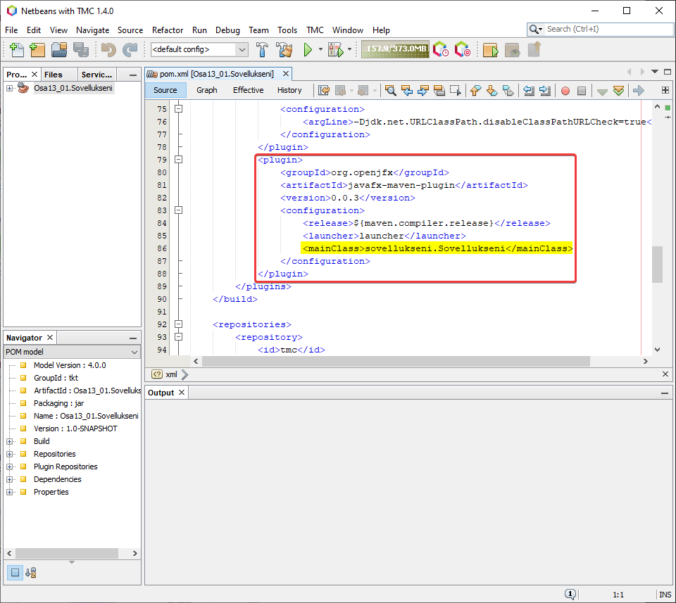
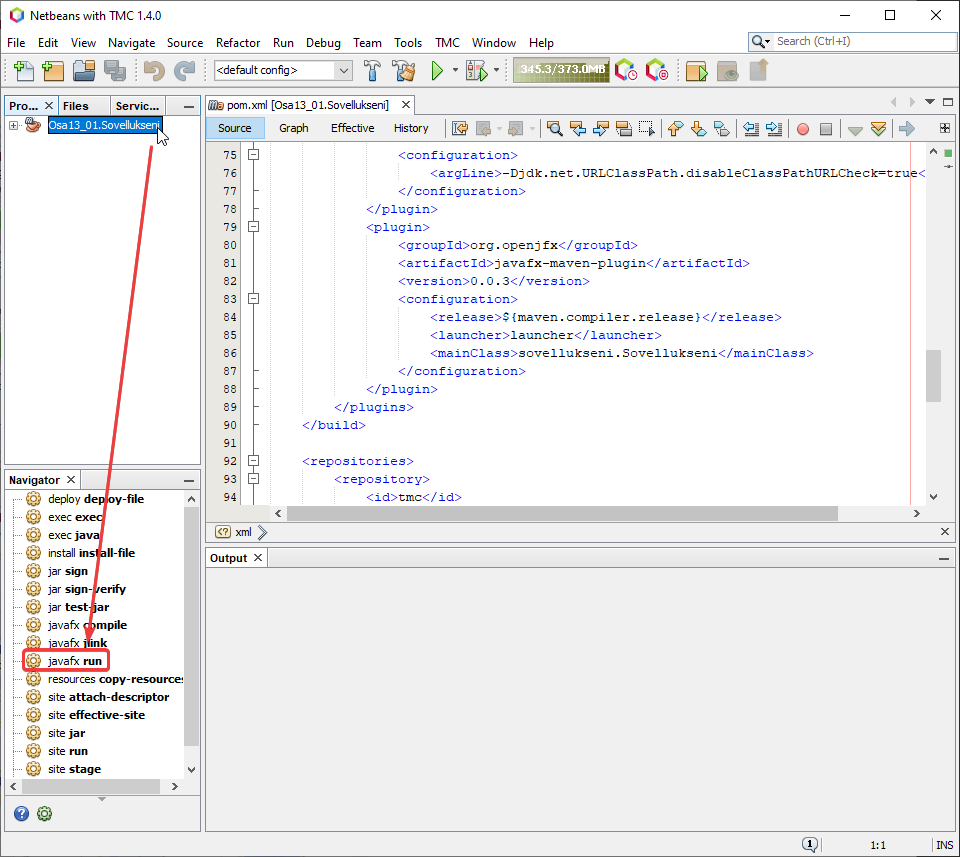

## JavaFX-tehtävien suorittaminen paikallisesti

Näin suoritat JavaFX-tehtävät paikallisesti. Nämä ohjeet toimivat, kun olet asentanut TMCBeans 1.3.0 tai uudemman ja OpenJDK 11:n ensimmäisen osan ohjeiden mukaisesti.

1. Valitse tehtävä, jonka haluat suorittaa paikallisesti.
2. Avaa kyseisen tehtävän POM.


3. Lisää seuraavat rivit dependencies-kohtaan:
```xml
    <dependency>
        <groupId>org.openjfx</groupId>
        <artifactId>javafx-controls</artifactId>
        <version>11</version>
    </dependency>


4. Lisää seuraavat rivit plugins-kohtaan:
```xml
    <plugin>
        <groupId>org.openjfx</groupId>
        <artifactId>javafx-maven-plugin</artifactId>
        <version>0.0.3</version>
        <configuration>
            <release>${maven.compiler.release}</release>
            <launcher>launcher</launcher>
            <mainClass>sovellukseni.Sovellukseni</mainClass>
        </configuration>
    </plugin>


**Huomioi, että mainClass-kohdassa pitää olla tehtävän pääluokka. Tehtävässä 13_01 se on `sovellukseni.Sovellukseni`, tehtävässä 2 se on `nappijatekstielementti.NappiJaTekstielementtiSovellus`. Muoto on siis `paketti.PääluokanNimi`.**
5. Käynnistä TMCBeans uudestaan, jotta muutosten vaikutus varmistuu.
6. Suorita ohjelma `javafx run`-napista. Näet tämän vaihtoehdon Navigator-välilehdellä kun painat tehtävän nimeä.


